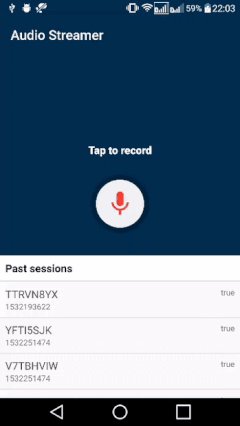

# Audio Streamer
A real-time audio streaming Android app that lets users record and stream audio to a local server and get simple analysis.

### Summary

This is a sample app to let user record audio and stream it to a local server in real-time. 
In return the server analyses the audio and generates some result data that is showed to the user. 
The user can see the list of past sessions, click on them to see the result and play the recording. 
 
 

  

 

* Written in **Kotlin** language, uses **AudioRecord** api
* Follows **MVP** architecture with Repository pattern

### Third Party Libraries
* [JorgeCastilloPrz/FABProgressCircle](https://github.com/JorgeCastilloPrz/FABProgressCircle)
* [square/okhttp](https://github.com/square/okhttp)
* [square/retrofit](https://github.com/square/retrofit)
* [square/moshi](https://github.com/square/moshi)

### License

    Copyright 2018 Swapnil Madavi

    Licensed under the Apache License, Version 2.0 (the "License");
    you may not use this file except in compliance with the License.
    You may obtain a copy of the License at

       http://www.apache.org/licenses/LICENSE-2.0

    Unless required by applicable law or agreed to in writing, software
    distributed under the License is distributed on an "AS IS" BASIS,
    WITHOUT WARRANTIES OR CONDITIONS OF ANY KIND, either express or implied.
    See the License for the specific language governing permissions and
    limitations under the License.

